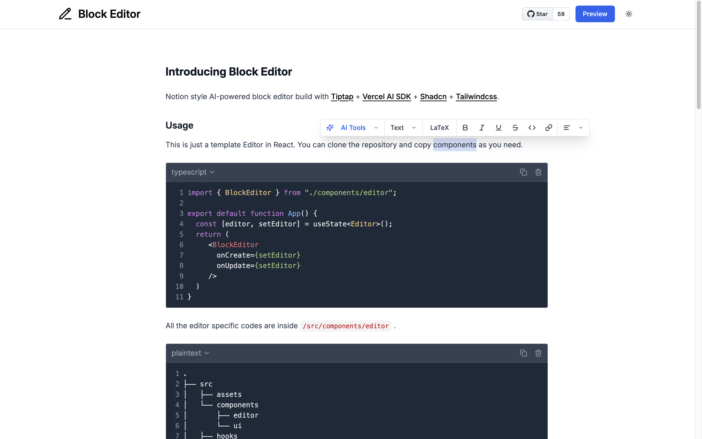

# Block Editor

Notion style AI-powered block editor build with [Tiptap](https://tiptap.dev/) + [Vercel AI SDK](https://sdk.vercel.ai/) + [Shadcn](https://ui.shadcn.com/) + [Tailwindcss](https://tailwindcss.com/).

**Demo**: [https://tiptap-block-editor.web.app/](https://tiptap-block-editor.web.app/)



## Custom extensions

- `code-block`: Syntax highlighted code block 
- `mathematics`: Mathematical symbols with LaTeX expression using [KaTeX](https://katex.org/)
- `table`: Notion style table manipulation
- `ai-writer`: Generate or modify contents with the help of LLM using [Vercel AI SDK](https://sdk.vercel.ai)
- `mermaid`: Render diagram as a code using [Mermaid](https://mermaid.js.org/)
- `chart`: Render charts using [Chart.js](https://www.chartjs.org/)

## Usage

This is just a template Editor in React. You can clone the repository and copy components as you need. This template used [Gemini](https://aistudio.google.com/) as AI model provider. You can change any provider supported by [Vercel AI SDK models](https://sdk.vercel.ai/docs/foundations/providers-and-models).

```javascript
// main.tsx

// import necessary styles
import "katex/dist/katex.min.css";
import "./components/editor/styles/block-editor.css";

import App from "./App.tsx";

// Setup mermaid
mermaid.initialize({
  startOnLoad: false,
  theme: "default",
});

mermaid.registerIconPacks([
  {
    name: "logos",
    loader: () => import("@iconify-json/logos").then((module) => module.icons),
  },
]);

// Setup chart.js
Chart.register(/* register plugins */);

createRoot(document.getElementById("root")!).render(
  <StrictMode>
    <App />
  </StrictMode>
);
```

```javascript
// App.tsx

import { BlockEditor } from "./components/editor";

export default function App() {
  const [editor, setEditor] = useState<Editor>();
  return (
     <BlockEditor 
      onCreate={setEditor}
      onUpdate={setEditor}
     />
  )
}
```

All the editor specific codes are inside `/src/components/editor` .
```bash
.
├── src                   
│   ├── assets     
│   └── components    
│       ├── editor        
│       └── ui       
│   ├── hooks     
│   └── lib       
└── ...
```

Required `.env` variables
```bash
VITE_GOOGLE_GENERATIVE_AI_API_KEY= # Your Gemini API Key
```

## Run locally
```bash
npm install
npm run dev
```

## License

Licensed under the [MIT license](https://github.com/phyohtetarkar/tiptap-block-editor/blob/main/LICENSE).