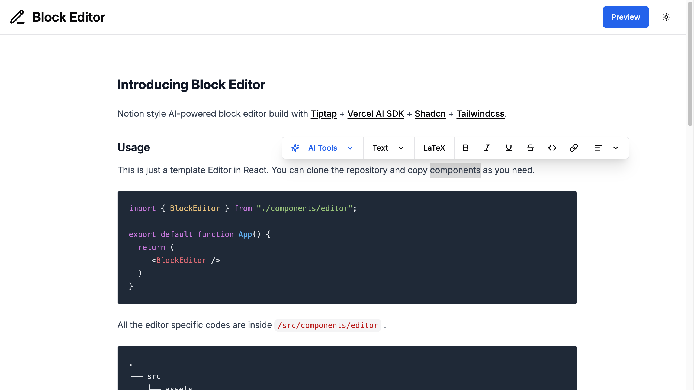

# Block Editor

Notion style AI-powered block editor build with [Tiptap](https://tiptap.dev/) + [Vercel AI SDK](https://sdk.vercel.ai/) + [Shadcn](https://ui.shadcn.com/) + [Tailwindcss](https://tailwindcss.com/).

**Demo**: [https://phyohtetarkar.github.io/tiptap-block-editor/](https://phyohtetarkar.github.io/tiptap-block-editor/)



## Usage

This is just a template Editor in React. You can clone the repository and copy components as you need. This template used [Gemini](https://aistudio.google.com/) as AI model provider. You can change any provider supported by [Vercel AI SDK models](https://sdk.vercel.ai/docs/foundations/providers-and-models).

```javascript

// These styles should be imported inside root layout
import "katex/dist/katex.min.css";
import "./components/editor/styles/block-editor.css";

import { BlockEditor } from "./components/editor";

export default function App() {
  return (
     <BlockEditor />
  )
}
```

All the editor specific codes are inside `/src/components/editor` .
```bash
.
├── src                   
│   ├── assets     
│   └── components    
│       ├── editor        
│       └── ui       
│   ├── hooks     
│   └── lib       
└── ...
```

Required `.env` variables
```bash
VITE_GOOGLE_GENERATIVE_AI_API_KEY= # Your Gemini API Key
```

## Run locally
```bash
npm install
npm run dev
```

## License

Licensed under the [MIT license](https://github.com/phyohtetarkar/tiptap-block-editor/blob/main/LICENSE).